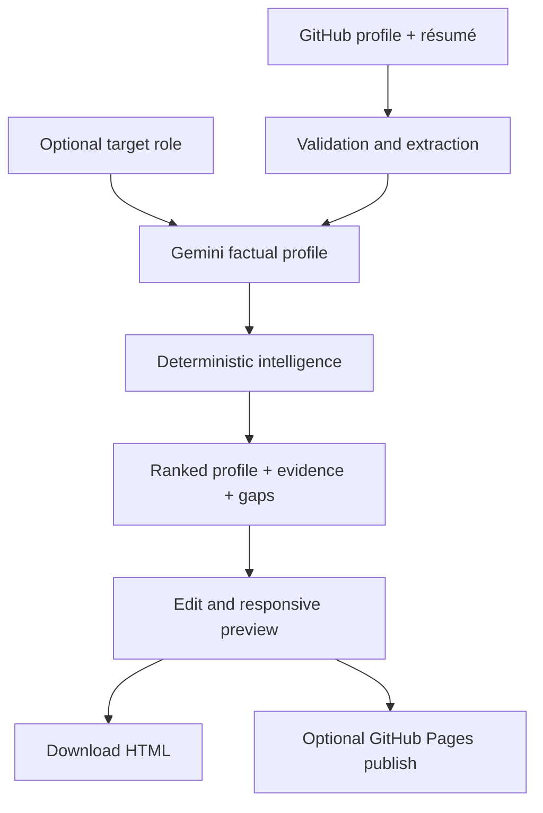

# DevPortfolio AI

DevPortfolio AI is an evidence-backed career-positioning workspace for developers. It combines a public GitHub profile, a résumé PDF, and an optional target role or job description to create a polished portfolio, prioritize the most relevant verified work, show where each claim came from, and identify profile gaps before an application is submitted.

**Live application:** [devportfolio-ai.raiseabdullah7.workers.dev](https://devportfolio-ai.raiseabdullah7.workers.dev/)

**Example generated portfolio:** [abdullahraise.github.io/DevPortfolio](https://abdullahraise.github.io/DevPortfolio/)


## The problem it solves

Developers often have useful evidence scattered across repositories and a résumé, but a generic portfolio does not explain which work matters for a specific opportunity. DevPortfolio AI turns those sources into a role-aware, inspectable portfolio rather than inventing a profile from a template.

- Reorders existing projects and skills for a target role without fabricating experience.
- Maps project, skill, experience, and education claims back to GitHub or résumé evidence.
- Produces a deterministic readiness score and actionable gap report.
- Lets the user refresh the same sources and see whether repositories changed.
- Keeps the final site editable, downloadable, and owned by the user.

## Features

- Extracts experience, education, skills, contacts, and projects from a text-based résumé PDF and public GitHub profile.
- Accepts an optional target role or job description for relevance-based presentation.
- Uses Gemini for one schema-constrained factual profiling pass.
- Applies deterministic post-processing for relevance ranking, evidence mapping, and gap detection.
- Provides five responsive themes: Bento, Editorial, Terminal, Studio, and Mono.
- Supports instant content editing and desktop, tablet, and mobile previews.
- Refreshes GitHub and résumé sources on demand and reports new or updated repositories.
- Downloads a dependency-free, single-file portfolio.
- Optionally publishes to a new GitHub repository and enables GitHub Pages.
- Processes uploaded PDFs for the active request without persisting them.

## Architecture



The browser owns inputs, editing, theme selection, preview, refresh confirmation, and export actions. Server routes validate inputs, extract PDF text, retrieve public GitHub data, call Gemini, normalize the response, and calculate evidence and gaps. API keys and publishing tokens are never included in exported portfolios. See [the architecture guide](docs/ARCHITECTURE.md) for the full flow and trust boundaries.

## Run locally on a new computer

### Requirements

- Node.js 22.13 or later (Node.js 22 LTS is recommended)
- pnpm 11 (`pnpm@11.25.0` is pinned in `package.json`)
- A [Gemini API key](https://aistudio.google.com/app/apikey)

No GitHub token or Cloudflare account is required for normal local generation. A GitHub PAT is needed only if you deliberately test the optional **Publish** feature.

### 1. Download the project

Using Git is recommended:

```bash
git clone https://github.com/Abdullahraise/DevPortfolio-AI.git
cd DevPortfolio-AI
```

Alternatively, open the repository on GitHub, choose **Code → Download ZIP**, extract it, and open a terminal inside the extracted `DevPortfolio-AI` folder.

### 2. Install the exact dependencies

```bash
node --version
corepack enable
corepack pnpm --version
pnpm install --frozen-lockfile
```

The version command should report pnpm `11.25.0`. If `corepack` is unavailable, install pnpm 11 using the [official pnpm installation instructions](https://pnpm.io/installation), reopen the terminal, and run the same frozen install command.

### 3. Configure Gemini locally

On macOS, Linux, or Git Bash:

```bash
cp .env.example .env.local
```

On Windows PowerShell:

```powershell
Copy-Item .env.example .env.local
```

Open `.env.local` and add the server-side key:

```env
GEMINI_API_KEY=your_gemini_api_key
```

Do not add quotes, a `NEXT_PUBLIC_` prefix, or commit this file. Restart the development server whenever the key changes.

### 4. Start and test the application

```bash
pnpm dev
```

Open [http://localhost:5173](http://localhost:5173). Enter a public GitHub username or profile URL, upload a selectable-text PDF of 5 MB or less, optionally add a target role, and choose **Generate website**.

Expected result: the generator opens, Gemini returns a portfolio, all five themes can be selected, and the downloaded portfolio is a single standalone HTML file.

Scanned image-only PDFs require OCR before upload. Public GitHub requests are unauthenticated, so GitHub may temporarily rate-limit heavy repeated testing.

### Local troubleshooting

| Symptom | Fix |
| --- | --- |
| `Gemini API key` configuration error | Confirm `.env.local` is in the repository root, contains `GEMINI_API_KEY=...`, and restart `pnpm dev`. |
| `pnpm` or Corepack version error | Run `corepack enable`, then `corepack pnpm --version`; use pnpm 11.25.0. |
| Port 5173 is already in use | Stop the process using that port, then run `pnpm dev` again. |
| PDF produces little or no résumé content | Export it as a selectable-text PDF or apply OCR first; keep it below 5 MB. |
| GitHub temporarily rate-limits requests | Wait briefly and retry with the same public profile. |

## Judge verification checklist

1. Generate once without a target role and inspect the five themes and device previews.
2. Generate again with a role such as `Java backend developer` and confirm that supported projects and skills are reordered, not invented.
3. Open **Improvement report** and **Evidence map** in the customizer.
4. Use **Refresh sources** to re-analyze the inputs and compare repository changes.
5. Edit the headline or bio, disable a project, and download the standalone HTML file.

Run the same checks used by continuous integration:

```bash
pnpm test
pnpm exec tsc --noEmit
pnpm run lint
pnpm run build
```

A successful clean verification currently reports **23 passing tests**, followed by successful TypeScript, ESLint, and production-build checks. These commands do not require a real Gemini key; a real key is required for the browser generation test.

## Environment variables

| Variable | Required | Purpose |
| --- | --- | --- |
| `GEMINI_API_KEY` | Yes | Server-side résumé and GitHub profile analysis |

Never expose this value through a `NEXT_PUBLIC_` variable and never commit `.env.local`.

## Optional GitHub Pages publishing

The workspace can publish a generated portfolio. The user first creates a new, empty, public GitHub repository and then provides its `owner/repository` name plus either a classic PAT or a fine-grained token.

For a classic PAT, enable the `repo` scope. For a fine-grained PAT, restrict it to the target repository and grant:

- **Contents:** Read and write
- **Pages:** Read and write

The publish route accepts classic `ghp_` and fine-grained `github_pat_` tokens only over HTTPS or localhost. It never stores or logs the token, refuses non-empty repositories, creates only `index.html`, and enables GitHub Pages. Revoke the temporary token immediately after publishing.

## Cloudflare Workers deployment

The application needs a server runtime because `/api/generate` uses a private Gemini key. The exported portfolio itself is static.

For a manual deployment:

```bash
pnpm run build
pnpm exec wrangler deploy --config dist/server/wrangler.json
pnpm exec wrangler secret put GEMINI_API_KEY --name devportfolio-ai
```

For this repository, Cloudflare is connected to the `main` branch. A successful push to `main` automatically starts a new build using:

```text
Build command:  pnpm run build
Deploy command: pnpm exec wrangler deploy --config dist/server/wrangler.json
```

`GEMINI_API_KEY` must be configured as a **runtime Worker secret**, not committed to Git and not added as a public variable. Existing runtime secrets normally remain attached across deployments, so no manual redeploy is needed after each code push. Confirm the new deployment under **Workers & Pages → devportfolio-ai → Builds & deployments**; manually deploy only if that integration is disabled or the build fails.

## Security and reliability

- Gemini keys remain server-side.
- GitHub PATs are used only for the explicit publish request and are never stored or logged.
- Publishing is limited to HTTPS or localhost and refuses to overwrite a non-empty repository.
- Résumé data is processed per request and is not persisted by this application.
- Generated links and HTML are sanitized before preview or export.
- AI produces structured content; tested application code owns HTML, CSS, responsiveness, and publishing behavior.
- Role targeting only reorders source-supported facts.
- The repository excludes `.env.local`, API keys, access tokens, dependencies, and build output.

If any secret is exposed, revoke it immediately and remove it from Git history before making the repository public.

## Current scope

Source refresh is user-triggered and compares the current GitHub repository snapshot. Scheduled monitoring would require user accounts, durable storage, and GitHub authorization or webhooks; those are intentionally outside this submission rather than being simulated.

## License

No open-source license has been granted. The source is public for project review and evaluation; copyright remains with the project author.
