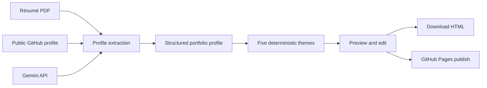

# DevPortfolio AI

DevPortfolio AI turns a public GitHub profile and résumé PDF into a polished, editable developer portfolio. Gemini performs one factual profiling pass; the application renders the result through five deterministic, responsive themes that switch instantly and remain reliable during a live demo.

[View a generated portfolio](https://abdullahraise.github.io/DevPortfolio/)


## Features

- Extracts experience, education, skills, and projects from a résumé and public GitHub profile.
- Uses one Gemini profiling call instead of fragile AI-generated HTML.
- Provides five distinct themes: Bento, Editorial, Terminal, Studio, and Mono.
- Supports instant content editing and responsive desktop/mobile previews.
- Downloads a dependency-free, single-file portfolio.
- Optionally publishes to a fresh GitHub repository and enables GitHub Pages.
- Unlocks Share and Embed only after a real deployment URL exists.
- Processes résumé PDFs per request without persisting them.

## Architecture



The browser handles inputs, editing, theme selection, and preview. Server routes extract PDF text, fetch public GitHub data, call Gemini, normalize the structured result, and perform optional one-request publishing. Tokens and API keys are never included in client bundles or exported portfolios. See [Architecture](docs/ARCHITECTURE.md) for the full data flow and trust boundaries.

## Local setup

### Requirements

- Node.js 22 or later
- pnpm 11 (the repository pins `pnpm@11.25.0`)
- A Gemini API key

```bash
git clone https://github.com/Abdullahraise/DevPortfolio-AI.git
cd DevPortfolio-AI
pnpm install
cp .env.example .env.local
```

Add your key to `.env.local`:

```env
GEMINI_API_KEY=your_gemini_api_key
```

Start the app:

```bash
pnpm dev
```

Open `http://localhost:5173`, enter a public GitHub profile, and upload a text-based PDF of 5 MB or less.

Before deploying, run the complete local check:

```bash
pnpm test
pnpm exec tsc --noEmit
pnpm run lint
pnpm run build
```

GitHub profiles are fetched without asking visitors for a personal access token. Uploaded PDFs are processed per request and are not persisted by the application.

## Environment variables

| Variable | Required | Purpose |
| --- | --- | --- |
| `GEMINI_API_KEY` | Yes | Server-side résumé and GitHub profile analysis |

Never expose this value through a `NEXT_PUBLIC_` variable or commit `.env.local`.

## Optional GitHub Pages publishing

Visitors can publish the generated portfolio from the workspace. They must first create a new public GitHub repository, then provide its `owner/repository` name and either a classic personal access token or a fine-grained token.

For a classic PAT, enable the `repo` scope. For a fine-grained PAT, restrict it to the target repository and grant:

- **Contents:** Read and write
- **Pages:** Read and write

The publishing route accepts classic `ghp_` and fine-grained `github_pat_` tokens only over HTTPS or localhost, never stores or logs them, refuses non-empty repositories, creates only `index.html`, and enables GitHub Pages. The visitor should revoke the token immediately after publishing. Share and Embed use the real Pages URL only after publication.

## Self-host on Cloudflare Workers

This repository builds to a Cloudflare Worker with static assets and a server-side `/api/generate` route. The generated portfolio HTML can be hosted separately on GitHub Pages, Netlify, or Vercel, but the DevPortfolio AI application itself needs a server runtime.

1. Create a Cloudflare account, then authenticate once:

   ```bash
   pnpm exec wrangler login
   ```

2. Build and deploy the worker:

   ```bash
   pnpm run build
   pnpm exec wrangler deploy --config dist/server/wrangler.json
   ```

3. Store the production secrets on the worker:

   ```bash
   pnpm exec wrangler secret put GEMINI_API_KEY --name devportfolio-ai
   ```

4. Redeploy after adding the secrets:

   ```bash
   pnpm run build
   pnpm exec wrangler deploy --config dist/server/wrangler.json
   ```

Cloudflare prints the public `workers.dev` URL after deployment. Add a custom domain later from **Workers & Pages → devportfolio-ai → Settings → Domains & Routes**.

Never commit `.env.local`, API keys, or access tokens. If you publish the repository to GitHub, push only source files and let Cloudflare keep the secrets.

## Production checks

- Accepts PDF files up to 5 MB.
- Escapes special regex characters before skill matching, including `C++`, `C#`, and `.NET`.
- Converts GitHub, PDF, API, scanned-document, and rate-limit failures into friendly UI messages.
- Keeps API keys server-side.
- Uses tested, dependency-free HTML/CSS renderers instead of asking AI to generate application code.
- Exports a dependency-free HTML portfolio ready for GitHub Pages, Netlify, or Vercel.
- Refuses to overwrite an existing repository during automatic publishing.

## Security

- Gemini keys remain server-side.
- GitHub PATs are accepted only for the explicit publish request and are never stored or logged.
- Publishing is limited to HTTPS or localhost.
- The publisher refuses non-empty repositories and never overwrites an existing `index.html`.
- Generated HTML is sanitized before preview or download.

If a secret is exposed, revoke it immediately and remove it from Git history before making the repository public.

## Screenshots

The screenshot above shows a portfolio generated and published through DevPortfolio AI. The live result is available at the linked GitHub Pages URL.

## License

No open-source license has been granted yet. The source is public for hackathon review and evaluation; copyright remains with the project author.
